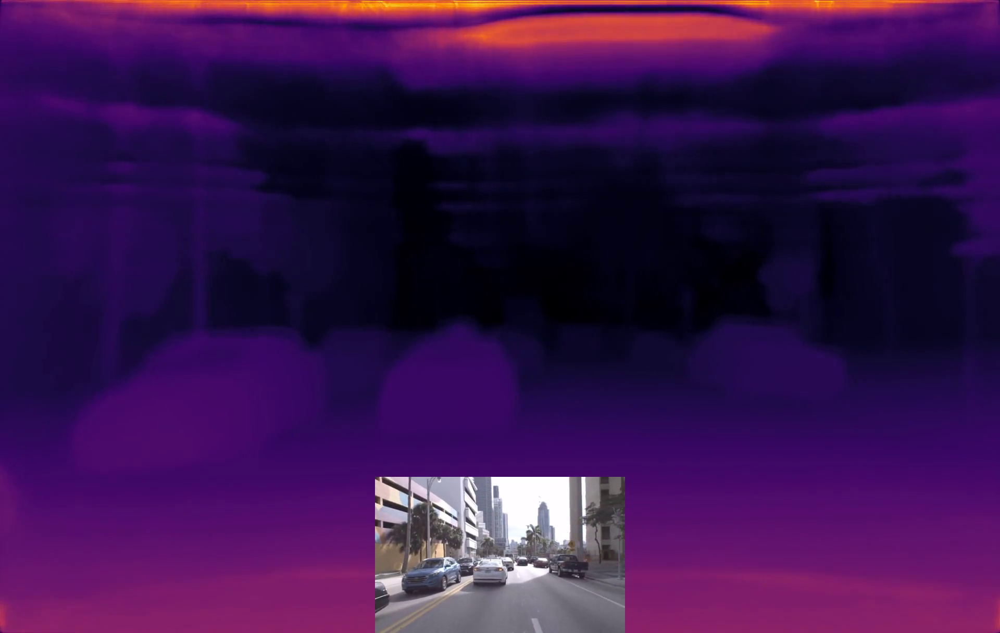
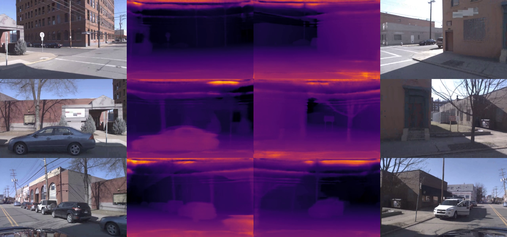

# Monocular-Depth-Estimation
Monocular depth estimation - Argo Lidar based Depth map Creation - Upto 200m

[]

Below are few sample depth estimation from the Argoverse trained Resnext101 BTS model. Click to watch the video on youtube.
## Depth estimation on Front Center Camera

## Depth estimation on Other Ring Cameras

Model trained on BTS arch - Check them out [here.](https://github.com/cogaplex-bts/bts)
